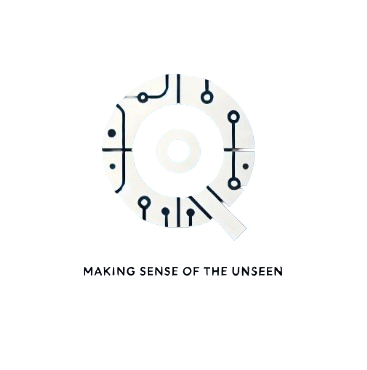

# 🚀 EyeQ - Advanced Medical Document Processing Platform


## 📌 Table of Contents
- [Introduction](#-introduction)
- [Features](#-features)
- [Technical Architecture](#-technical-architecture)
- [Installation](#-installation)
- [Usage](#-usage)
- [Performance](#-performance)
- [Contributor](#-contributor)
- [License](#-license)

## 🌟 Introduction
EyeQ is an advanced platform for intelligent processing of medical documents, developed in an academic context at Esprit School of Engineering. It combines computer vision and deep learning techniques to automate the analysis and classification of medical images.

### Key Technologies
- YOLOv11, PaddleOCR, Kafka, MLflow, FastAPI, OpenCV

## 🛠 Features
### 🔍 Intelligent Classification
- Accurate detection of 4 classes of medical documents
- Optimized YOLOv11 model
- High-performance REST API

### ✨ Image Enhancement
- Automatic image correction
- Quality improvement
- Defect detection and correction

### 📑 Layout Detection and Advanced OCR
- Extraction and structuring of textual information
- Model management and experiment tracking with MLflow

## 🏗 Technical Architecture
EyeQ's architecture follows a modular approach, where each microservice has a well-defined role and communicates with others via Kafka.

```plaintext
EyeQ/
├── yolo_classification/
├── image_enhancement/
├── layout_analysis/
└── docker-compose.yml
```

### Technologies Used
- **Deep Learning**: YOLOv11, PaddleOCR, RCNN, U-Net
- **Computer Vision**: OpenCV, PIL, PyTorch
- **Big Data Streaming**: Apache Kafka
- **Model Tracking**: MLflow
- **Containerization**: Docker, Docker Compose
- **Web Framework**: FastAPI

## ⚙ Installation
### Prerequisites
- Python 3.8+
- Docker & Docker Compose
- Apache Kafka & Zookeeper

### Deployment with Docker Compose
```bash
git clone https://github.com/RayenR1/EyeQ.git
cd EyeQ
docker-compose up -d --build
```

## 🖥 Usage
Example API call in Python:
```python
import requests
response = requests.post("http://localhost:8000/analyze", files={'file': open('doc.jpg','rb')})
print(response.json())
```

## 📊 Performance
| Metric                 | Value  |
|------------------------|--------|
| YOLOv11 Accuracy      | 95.0%  |
| Average Latency       | -.-s   |


## 👨💻 Contributor
Developed by **Rayen Jlassi**  
🔗 [GitHub @RayenR1](https://github.com/RayenR1)  
🔗 [LinkedIn](https://www.linkedin.com/in/rayen-jlassi-5867612bb/)  


**Skander kammoun**  
🔗 [GitHub @]()  
🔗 [LinkedIn](https://www.linkedin.com/in/skander-kammoun-467257267/)  

**Mariem Mhamdi**  
🔗 [GitHub @]()  
🔗 [LinkedIn](https://www.linkedin.com/in/mariem-mhamdi-bb027a254/)  

**ines kammoun**  
🔗 [GitHub @]()  
🔗 [LinkedIn](https://www.linkedin.com/in/ineskammoun/)  

**Yassine ben Makhtouf**  
🔗 [GitHub @](https://github.com/YassineBenMaktouf)  
🔗 [LinkedIn]() 

**Souhail ltifi**  
🔗 [GitHub @]()  
🔗 [LinkedIn]() 
## 📜 License
© 2025 EyeQ - Esprit School of Engineering - Doxaria

